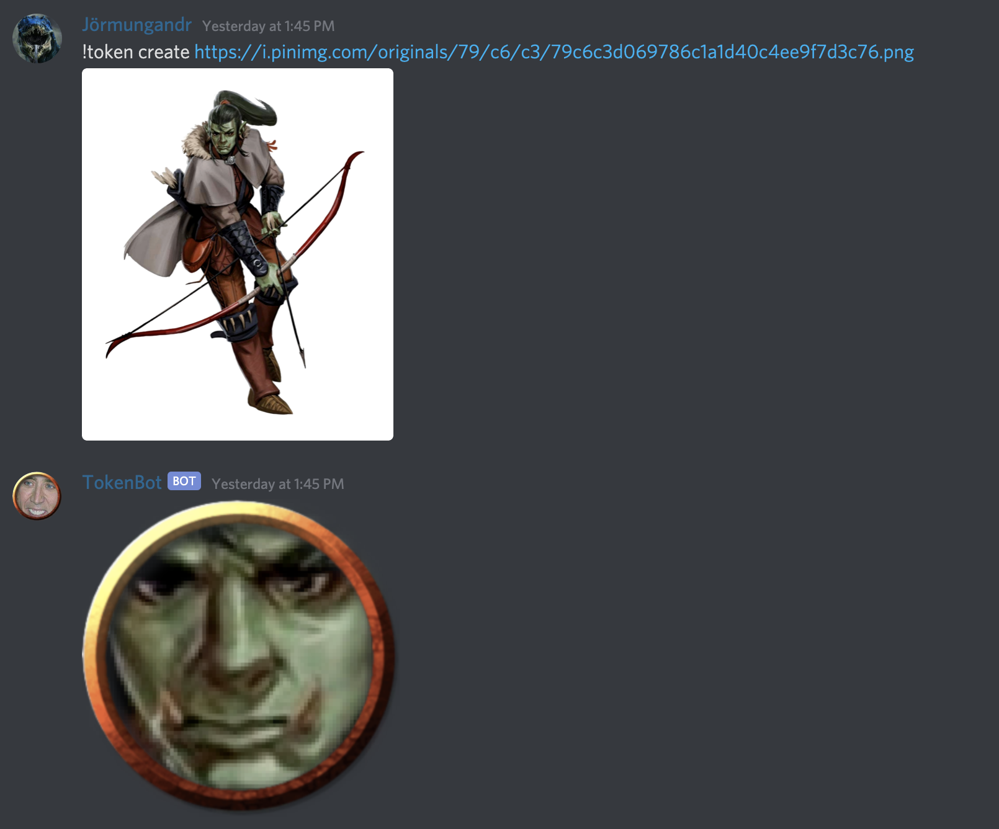

# tokenbot
A Discord bot which uses facial detection to create tokens for use with a digital tabletop such as [Roll20](https://roll20.net/).

**Note:** The bot first tries to fidn a face using HOG, then with a slower CNN-based method. I've not trained anything myself for finding faces in various types of art, and the facial detection I'm using was built for photographs of human faces. I tested it on around 1000 images, and it was able to find the face in roughly 40% of them using HOG, and around 60% of them using the slower CNN method. I haven't taken the time to quantify this, but my experience is that it's done poorly with images of characters who have large beards, and it does better the higher the resolution of the image/more realistic the art style.

## Usage
For now, only supports one command:

## Running the Bot
`python3 bot.py`
